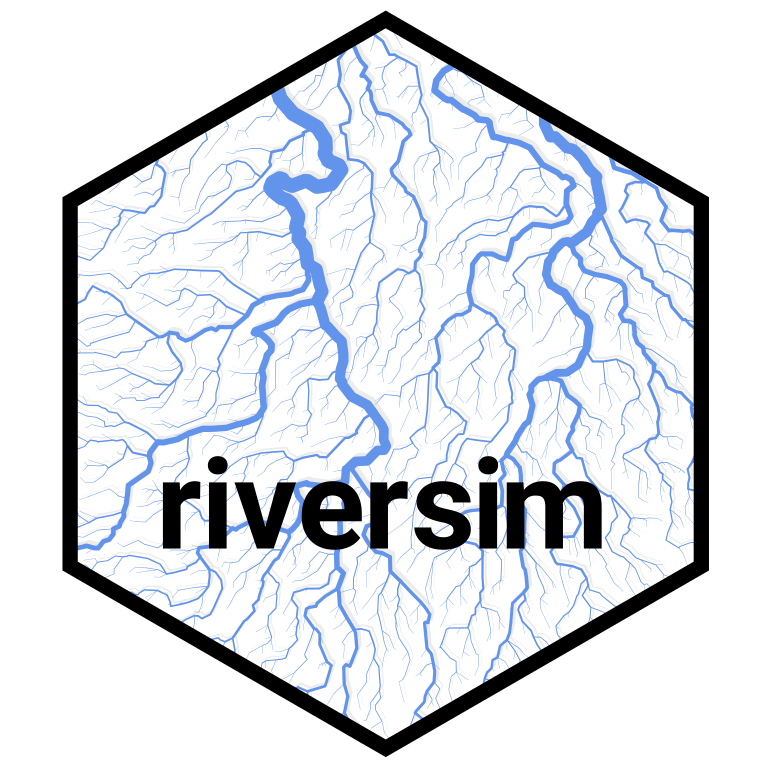
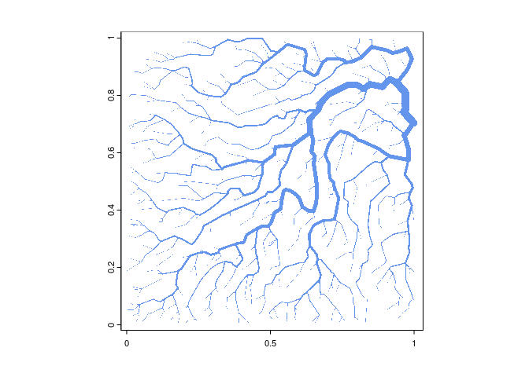
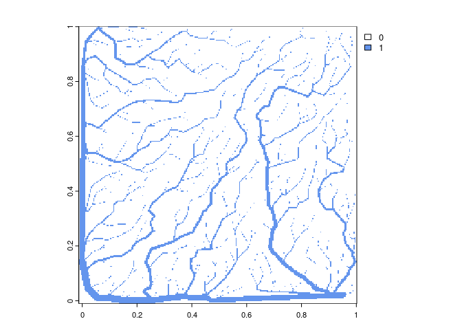

<!-- README.md is generated from README.Rmd. Please edit that file -->

# riversim 

`riversim` is an R-package that allows you to simulate river networks.
The algorithm was originally developed by a [reddit
user](https://www.reddit.com/r/proceduralgeneration/comments/ftgbgo/ive_been_working_on_an_algorithm_to_efficiently/).
To get some really nice-looking networks you will need to simulate many
more nodes than in the examples below (e.g. 10’000 or even 50’000).

## Installation

You can install the development version of riversim from
[GitHub](https://github.com/) with:

``` r
# install.packages("devtools")
devtools::install_github("DavidDHofmann/riversim")
```

## Example

Here is a simple example of a river network simulation

``` r
# Load required packages
library(riversim)

# Generate a river network and visualize it
river <- rivernetwork(1000, progressbar = F)
plot(river, col = "cornflowerblue", border = NA)
```



``` r

# You can also generate rasterized river networks
river <- rivernetwork(1000, raster = T, progressbar = F)
plot(river, col = c("white", "cornflowerblue"))
```


